# Pixar_Movies_Analysis
 Look into some renowned pixar movies to analyze specific patterns

#  Introduction

This project was created as part of a database systems assignment to analyze Pixar’s films using SQL. The dataset includes financial data, critical reception, genres, directors, and awards, normalized into six main tables.

The goal was to extract meaningful insights by writing efficient SQL queries that answer real-world analytical questions.

---

## 📁 Dataset

The dataset is originally provided as `pixar_dataset.xlsx` and was imported into a relational database. It includes:
- Film details
- Box office performance
- Ratings (Rotten Tomatoes, IMDb, Metacritic)
- Genres & subgenres
- Awards and nominations
- Crew roles

---

## 🔧 Tools Used

- VScode as IDLE
- PostgreSQL
- SQL (Joins, Aggregations, Conditional logic, Formatting)
- Excel (for initial sepearation into CSV & import)

---

## 🧠 Tasks & Objectives

### 1. **💰 Financial Performance**
> What are the top movies on ROI (Return on Investment)?
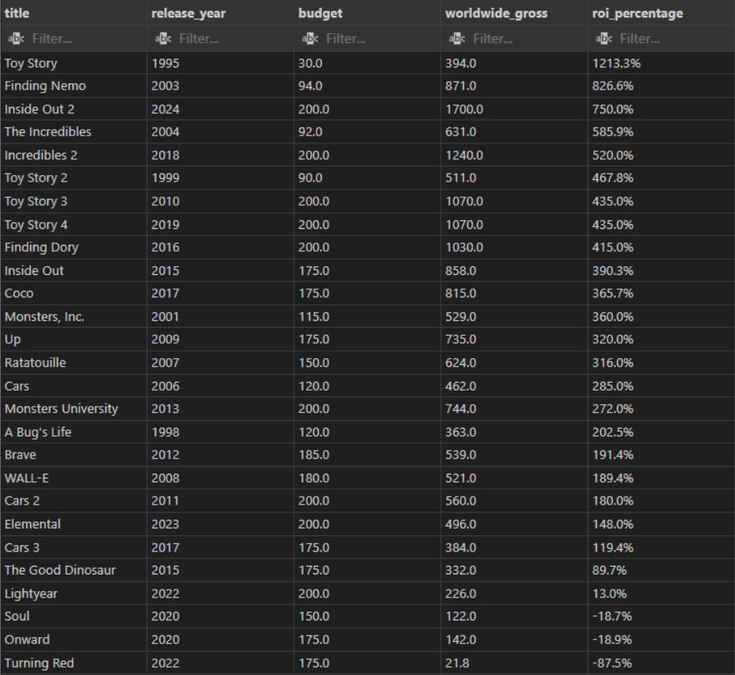
> Query
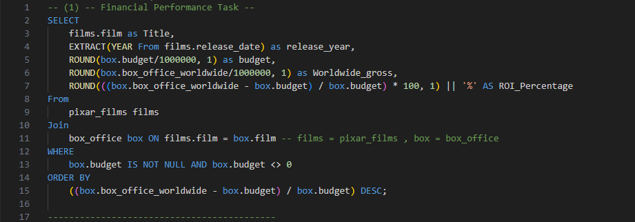

### 2. **🏆 Award Analysis**
> What are the top awards-winning movies?
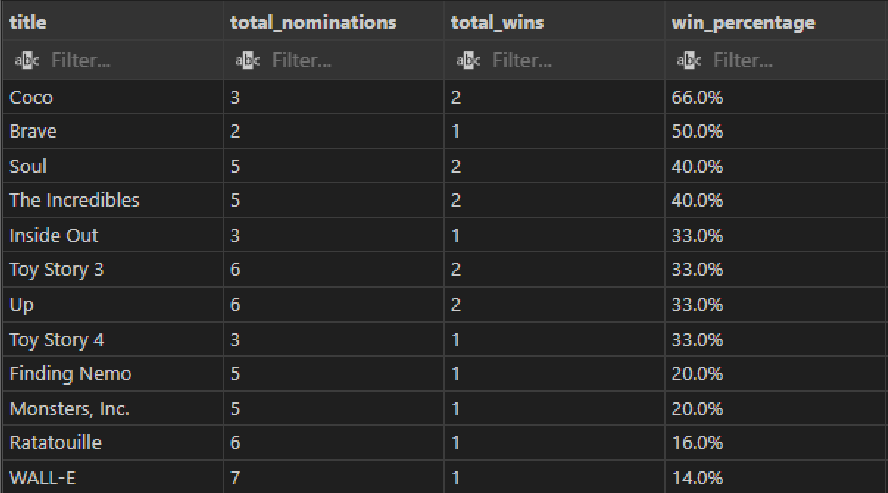

> Query
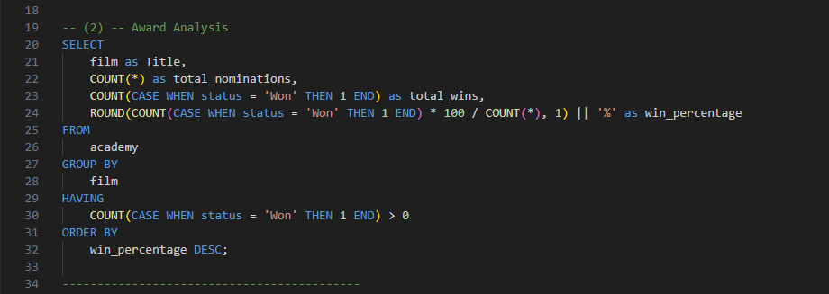
### 3. **🎭 Genre Profitability**
> What are the five most profitable subgenres?
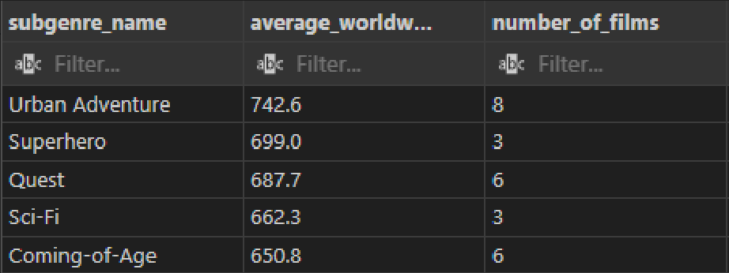

> Query
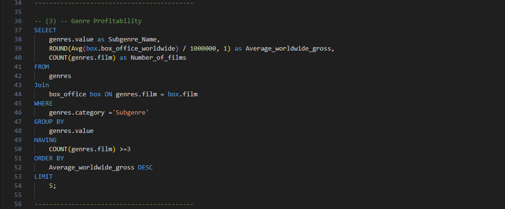
### 4. **🎬 Director Impact**
> What are the most profitable directors? and what are their average rotten tomatoes & IMDB score?
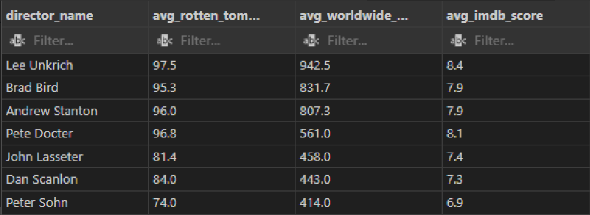

> Query
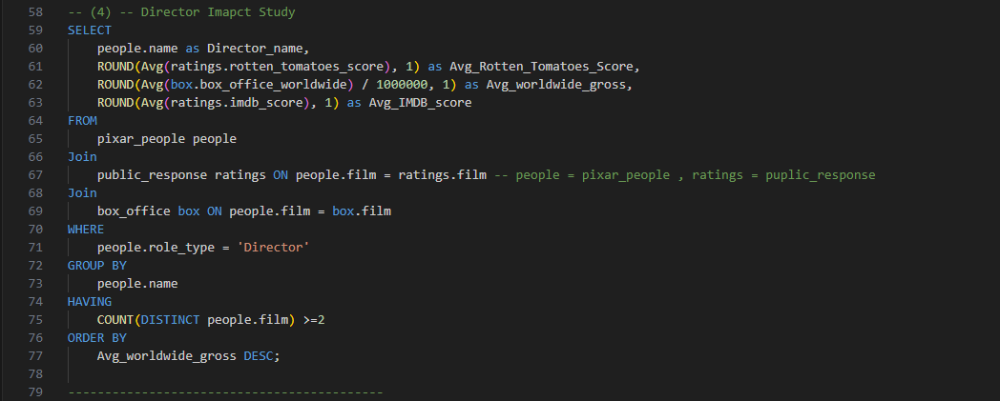
### 5. **🎥 Franchise Comparison**
> Compare the profit of the following film series: Toy Story, Cars, and
Finding Nemo/Dory?
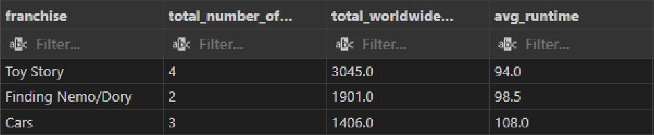

> Query
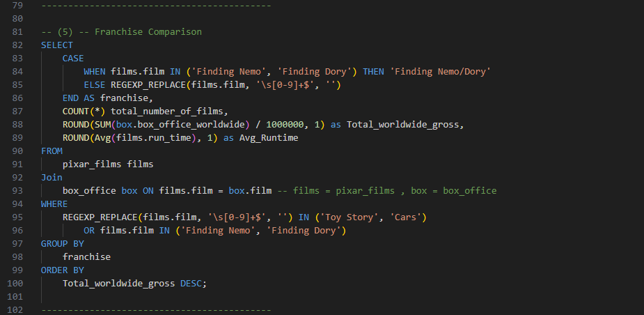
### 6. **📊 Budget Category Analysis**
> Categorize films into Low / Medium / High budget and analyze different metrics.
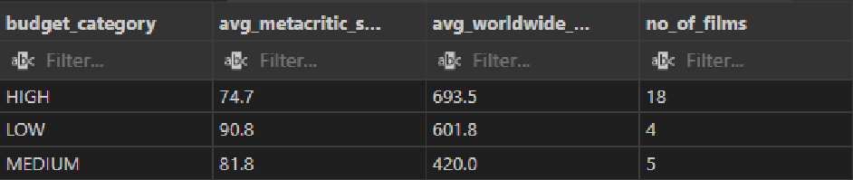

> Query
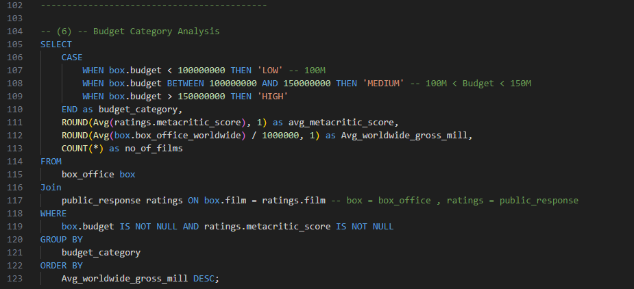
---

# 📎 Notes

#### - Monetary values are shown in **millions USD** (e.g., 394000000 → 394.0)
#### - Percentages are rounded to **one decimal** (e.g., 75.83 → 75.8%)

---
# Conclusion
This project was a hands-on way to practice working with a real-world SQL dataset. It covered key concepts like joins, aggregations, and conditional logic while answering practical business questions.

It helped me strengthen my SQL skills and get more comfortable analyzing structured data across multiple related tables.
